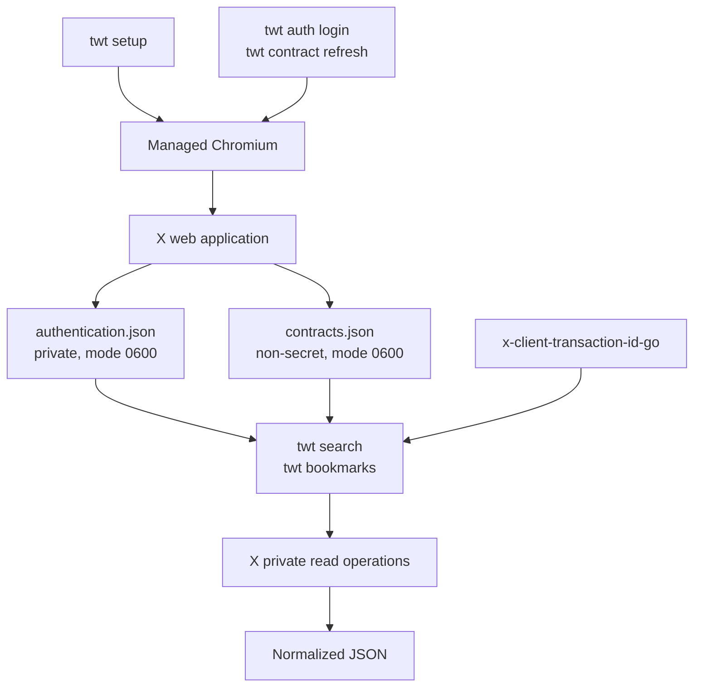

# x-twitter-cli

[](https://github.com/ach968/x-twitter-cli/actions/workflows/ci.yml)
[](https://github.com/ach968/x-twitter-cli/actions/workflows/release.yml)
[](https://github.com/ach968/x-twitter-cli/releases)
[](https://pkg.go.dev/github.com/ach968/x-twitter-cli)
[](go.mod)
[](LICENSE)

`x-twitter-cli` is an unofficial, local, read-only command-line client for X.
The `twt` executable provides stable JSON output for public search and the
authenticated account's bookmarks without exposing X's private response
formats to callers.

The v1 command surface is:

- `twt search` for Top, Latest, People, Media, and Lists search results.
- `twt bookmarks` for listing or searching the authenticated account's saved
  posts.
- `twt setup`, `twt auth`, and `twt contract` for local browser,
  authentication, and operation-contract maintenance.

Home timeline support is work in progress. Its internal transport remains in
the repository, but there is no public Home command and Home is not required
for setup, authentication, contract refresh, Search, or Bookmarks.

## Requirements


End users need:

- An X account they are permitted to access.
- Internet access to X during authentication and data commands.
- Go 1.26 or newer when installing with `go install`. Go is not needed when
  using a prebuilt release binary.
- Chromium for authentication and contract refresh. `twt setup` installs the
  revision managed by the project's browser library after asking for
  confirmation; a preinstalled system browser is not required or reused.

> [!NOTE]
> **No X developer API key is required.** `x-twitter-cli` authenticates through
> the user's own isolated X browser session; it does not use the official X API
> or require a developer account.

The Go dependencies are compiled into the `twt` binary. In particular,
[`x-client-transaction-id-go`](https://github.com/ach968/x-client-transaction-id-go)
generates current request metadata, [Rod](https://github.com/go-rod/rod)
manages the isolated Chromium process, and the JSON Schema library validates
the documented output contracts in tests. No Node.js runtime, browser
extension, background daemon, or everyday Chrome profile is required.

## Install

Install the latest tagged version with Go:

```bash
go install github.com/ach968/x-twitter-cli/cmd/twt@latest
```

Go normally writes the executable to `$(go env GOPATH)/bin`. Ensure that
directory is on `PATH`, then verify the command is available:

```bash
command -v twt
twt --version
```

To build the current checkout instead:

```bash
git clone https://github.com/ach968/x-twitter-cli.git
cd x-twitter-cli
go build -o twt ./cmd/twt
```

Tagged releases publish prebuilt Linux `amd64` and `arm64` archives plus a
checksum file on [GitHub Releases](https://github.com/ach968/x-twitter-cli/releases).

Installing the binary does not launch a browser, download Chromium, change
Codex configuration, or authenticate to X.

## First-time setup and authentication

Prepare the managed Chromium revision:

```bash
twt setup
```

The command reports whether Chromium needs to be installed or updated and
asks before downloading it. After a successful update, it may separately
offer to remove older managed revisions; cleanup defaults to no because older
`twt` versions may still need them.

Then authenticate:

```bash
twt auth login
```

Authentication uses a dedicated Chromium profile owned by `twt`, not the
user's everyday browser profile. The command first checks that profile
headlessly. If X requires a login or interactive challenge, it opens a headed
Chromium window for the user to complete the flow. Once authenticated, it
captures the current Search and Bookmarks request contracts, verifies that the
three required read operations work, and activates the new local state only
after validation succeeds.

By default, sensitive and generated state is stored at:

```text
~/.config/x-twitter-cli/authentication.json       captured cookies and authorization
~/.config/x-twitter-cli/contracts.json            active non-secret request contracts
~/.local/state/x-twitter-cli/chromium-profile/    isolated Chromium profile
```

`XDG_CONFIG_HOME` and `XDG_STATE_HOME` replace the corresponding default
roots when set. Authentication and contract files are written with user-only
permissions, and their parent directories use user-only access. The
authentication file and Chromium profile are credentials: never commit,
publish, attach, or share them.

Inspect local state without opening Chromium or contacting X:

```bash
twt contract status
```

X can change its private web operations independently of this project. When a
data command reports `CONTRACT_FAILED`, explicitly refresh the local contracts
and then rerun the original command:

```bash
twt contract refresh
```

Refresh follows the same headless-first authentication behavior. Data commands
never refresh contracts, open Chromium, log in, or retry themselves.

## Command documentation

The [official command reference](docs/commands.md) documents Search,
Bookmarks, browser setup, authentication, contract maintenance, pagination,
JSON output, warnings, and failure recovery. The installed binary also provides
concise help through `twt --help` and `twt <command> --help`.

## Output and failures

Each successful data command writes one JSON document to standard output.
Usable partial pages may include structured warnings and still exit zero.
Argument, authentication, local-state, transport, rate-limit, stale-contract,
and incompatible-response failures write a stable JSON error document to
standard error and exit nonzero.

The normalized output is the product interface. Raw authenticated X responses
are private diagnostic evidence and are never exposed by a data-command flag.

## How it works



Chromium is used only to establish authentication and discover X's current
private request descriptions. Search and Bookmarks commands subsequently load
the local authentication and contract files, generate any required volatile
transaction metadata, send the corresponding request directly to X, and
normalize X's timeline-shaped response into the documented JSON contracts.

This separation means ordinary data reads do not launch Chromium, while
contract changes can be recovered explicitly without bundling short-lived X
query identifiers in the binary. It does not make the private upstream
operations stable: X may change or remove them at any time.

## Development

```text
cmd/twt/                  executable and production dependency wiring
internal/app/cli/         command routing, validation, rendering, and exits
internal/app/operations/  Search and Bookmarks policy and normalization
internal/app/httpclient/  authenticated direct-request mechanics
internal/app/browser/     managed Chromium, profile, and contract capture
internal/app/contracts/   local contract-file validation
internal/app/state/       XDG paths and persisted state
internal/app/workflow/    candidate validation and activation
test/                     schemas, browser integration, and live test seams
docs/                     output contracts, design history, and agent guidance
.scratch/                 local specifications, issues, and disposable experiments
.scratch/.sandbox/        experimental helpers outside the public CLI surface
```

Run deterministic release checks:

```bash
make check
make check-browser
```

`make check` covers formatting, vet, and race-enabled tests.
`make check-browser` additionally exercises real local Chromium against
controlled local pages. It defaults to `/usr/bin/chromium`; override it with
`make check-browser CHROMIUM=/path/to/chromium` when needed.

Hosted CI runs `make check` plus `govulncheck`. Browser integration remains a
local release gate so runner-specific Chromium sandbox behavior cannot obscure
the deterministic CI signal.

Authenticated live-X tests are an explicit, local release gate and must not run
in ordinary CI:

```bash
make test-live CHROMIUM=/path/to/chromium
```

They use the local application profile, validate transport and semantic
operation success without asserting account contents, and never print
authenticated response bodies.

Run `make help` for the complete development target list. The more detailed
[design history](docs/design-interview.md) explains the architectural choices.

## License and disclaimer

This project is available under the [MIT License](LICENSE).

`x-twitter-cli` is not affiliated with, endorsed by, or sponsored by X Corp.
It uses private web operations rather than a supported public API, so it may
stop working when X changes its site. Users are responsible for complying with
X's terms and all rules applicable to their accounts and data.
